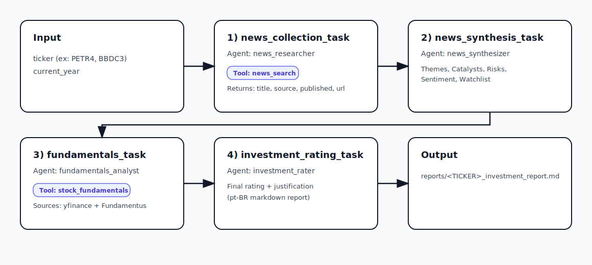

# CrewAI Invest Reporter

Generate an **investment report (pt-BR)** for a given Brazilian stock ticker (B3), combining:

- **Recent news headlines** (Google News RSS)
- **Fundamentals + market data** (best-effort merge of `yfinance` and Fundamentus)
- A final **investment rating** with risks and what could change the view

Reports are written to `reports/<TICKER>_investment_report.md`.

## What the application does

Given a ticker like `PETR4` or `BBDC3`, the crew:

1. Collects recent news items related to the company/ticker
2. Synthesizes the news into themes, catalysts, risks, sentiment, and a watchlist
3. Fetches fundamentals and market/price metrics
4. Produces a final investment classification and a full markdown report (pt-BR)

## Architecture

### Flow diagram



### Agents

Agents are defined in `src/crewai_invest_reporter/config/agents.yaml`.

- **`news_researcher`**
  - **Role**: Financial News Researcher
  - **Goal**: collect relevant and trustworthy news for `{ticker}`
  - **Tooling**: uses the `news_search` tool

- **`news_synthesizer`**
  - **Role**: News Synthesizer & Risk Analyst
  - **Goal**: turn the news list into themes, catalysts, risks, sentiment, watchlist

- **`fundamentals_analyst`**
  - **Role**: Fundamental & Market Data Analyst
  - **Goal**: fetch fundamentals + market metrics for `{ticker}`
  - **Tooling**: uses the `stock_fundamentals` tool

- **`investment_rater`**
  - **Role**: Investment Decision Analyst
  - **Goal**: combine news + fundamentals to issue a final rating and produce the report

### Tasks / Flow

Tasks are defined in `src/crewai_invest_reporter/config/tasks.yaml` and run **sequentially**:

1. **`news_collection_task`** (agent: `news_researcher`)
   - Uses `news_search` to return a list of items with:
     - `title`, `source`, `published`, `url`

2. **`news_synthesis_task`** (agent: `news_synthesizer`)
   - Synthesizes the news list into:
     - Themes, Catalysts, Risks, Sentiment, Watchlist

3. **`fundamentals_task`** (agent: `fundamentals_analyst`)
   - Uses `stock_fundamentals` to fetch best-effort metrics from:
     - `yfinance`
     - Fundamentus (scraped)

4. **`investment_rating_task`** (agent: `investment_rater`)
   - Produces the final report in **Brazilian Portuguese (pt-BR)** and saves it to:
     - `reports/{ticker}_investment_report.md`

### Tools

Tools live in `src/crewai_invest_reporter/tools/`.

- **`news_search`** (`NewsSearchTool`)
  - Source: Google News RSS
  - Output: a structured list with *headline metadata only* (it does **not** download full article text)

- **`stock_fundamentals`** (`StockFundamentalsTool`)
  - Sources: `yfinance` + Fundamentus (best-effort merge)
  - Output: fundamentals + price metrics and discrepancy hints

## Requirements

- Python `>=3.10,<3.14`

## Environment variables (`.env`)

Create a `.env` file in the repository root.

Example:

```bash
# Required if you are using OpenAI models
OPENAI_API_KEY=your_openai_api_key_here

# Optional (depends on your CrewAI configuration / provider)
# OPENAI_MODEL=gpt-4o-mini
```

Notes:

- Never commit your `.env`.
- If you switch to a local model/provider, the required variables may change.

## Installation

### Option A: Using `uv` (recommended)

```bash
pip install uv
uv sync
```

### Option B: Using `pip`

```bash
python -m venv .venv
source .venv/bin/activate
pip install -e .
```

## Running

### Run from Python (simple)

Run the crew for a given ticker:

```bash
python -m crewai_invest_reporter.main PETR4
```

Example:

```bash
python -m crewai_invest_reporter.main BBDC3
```

### Output

After running, you will find the report at:

- `reports/PETR4_investment_report.md`
- `reports/BBDC3_investment_report.md`

## Customization

- **Agents**: `src/crewai_invest_reporter/config/agents.yaml`
- **Tasks and report structure**: `src/crewai_invest_reporter/config/tasks.yaml`
- **Tools**:
  - `src/crewai_invest_reporter/tools/news_search_tool.py`
  - `src/crewai_invest_reporter/tools/stock_fundamentals_tool.py`

## Limitations

- The news pipeline is based on **headlines** (title/source/date/url). It can miss important details that are only present in the full article text.
- Fundamentus scraping may fail due to site changes/rate limits; the tool is best-effort and reports errors in the returned payload.
